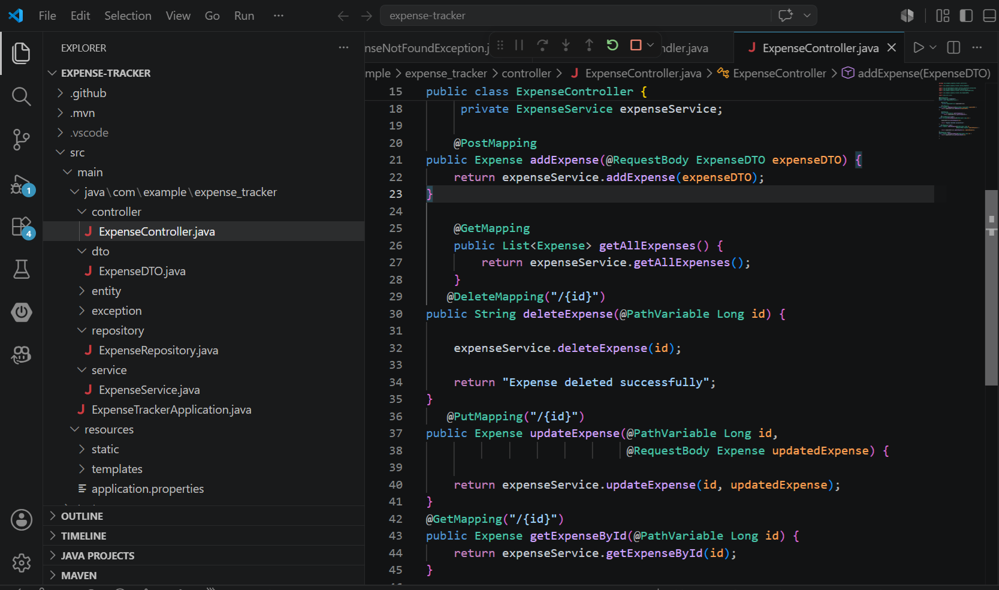
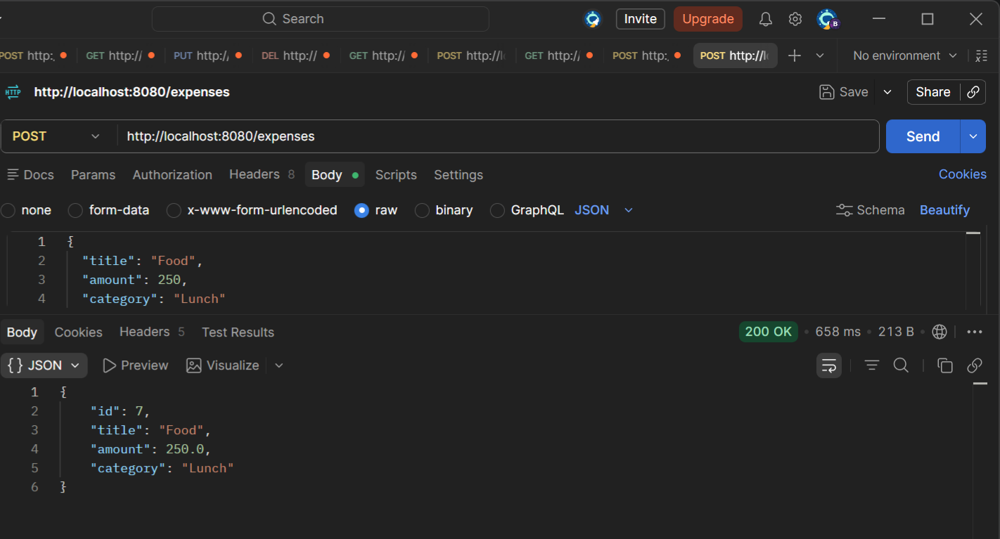
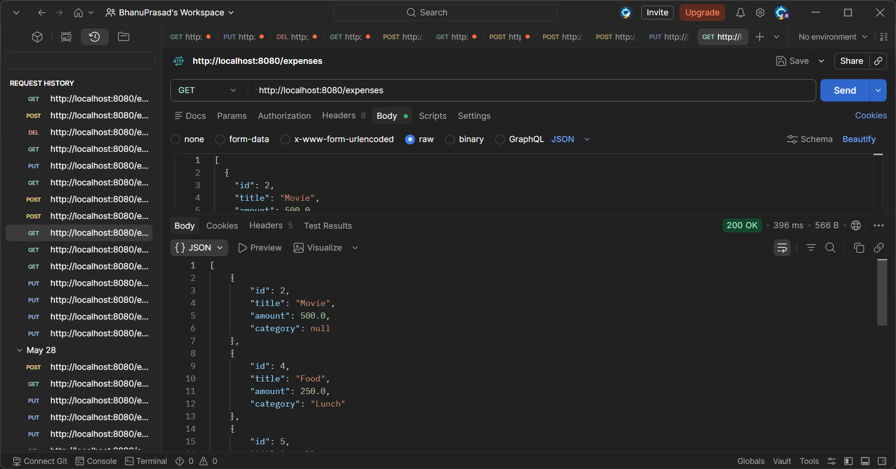
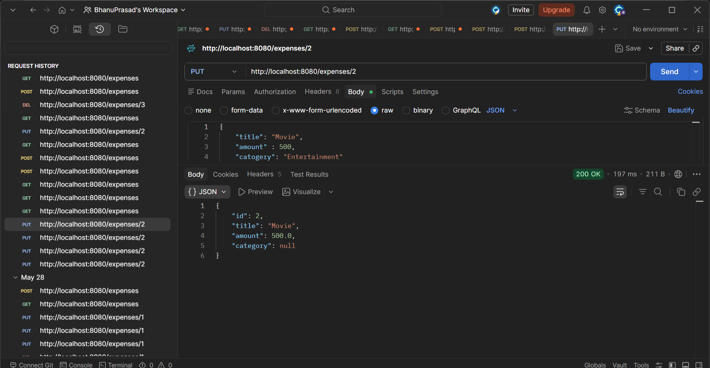

# Expense Tracker API


A Spring Boot REST API for managing daily expenses with complete CRUD functionality, built using DTO pattern, service layer architecture, and global exception handling.

## Features
- Create Expense
- View All Expenses
- View Expense by ID
- Update Expense
- Delete Expense
- DTO Pattern
- Service Layer Architecture
- Global Exception Handling
- Spring Data JPA
- MySQL Database

## Tech Stack
- Java 17
- Spring Boot
- Spring Data JPA
- Hibernate
- MySQL
- Maven
- Postman
- Git & GitHub

## API Endpoints

| Method | Endpoint | Description |
|--------|----------|-------------|
| POST | /expenses | Create Expense |
| GET | /expenses | Get All Expenses |
| GET | /expenses/{id} | Get Expense by ID |
| PUT | /expenses/{id} | Update Expense |
| DELETE | /expenses/{id} | Delete Expense |

## Project Structure
src/main/java/com/example/expense_tracker
├── controller       → REST endpoints (ExpenseController)
├── dto              → Data Transfer Objects (ExpenseDTO)
├── entity           → JPA Entities (Expense)
├── exception        → Global Exception Handling
├── repository       → Spring Data JPA Repository
└── service          → Business Logic Layer

## Getting Started

### Prerequisites
- Java 17
- Maven
- MySQL

### Setup

1. Clone the repository
```bash
   git clone https://github.com/gbhanuprasad5261/expense-tracker.git
   cd expense-tracker
```

2. Configure your database in `src/main/resources/application.properties`
```properties
   spring.datasource.url=jdbc:mysql://localhost:3306/expense_tracker
   spring.datasource.username=your_username
   spring.datasource.password=your_password
   spring.jpa.hibernate.ddl-auto=update
```

3. Run the application
```bash
   mvn spring-boot:run
```

4. The API will be available at `http://localhost:8080`

## Sample Request/Response

**POST** `/expenses`

Request body:
```json
{
  "title": "Food",
  "amount": 250,
  "category": "Lunch"
}
```

Response:
```json
{
  "id": 7,
  "title": "Food",
  "amount": 250.0,
  "category": "Lunch"
}
```

## Screenshots

### REST Controller – CRUD Endpoints


### POST /expenses – Create Expense


### GET /expenses/{id}


### PUT /expenses/{id} – Update Expense


## Author

**Bhanu Prasad**
- GitHub: [gbhanuprasad5261](https://github.com/gbhanuprasad5261)
- LinkedIn: [g-bhanu-prasad](https://linkedin.com/in/g-bhanu-prasad-66ab1b225)
